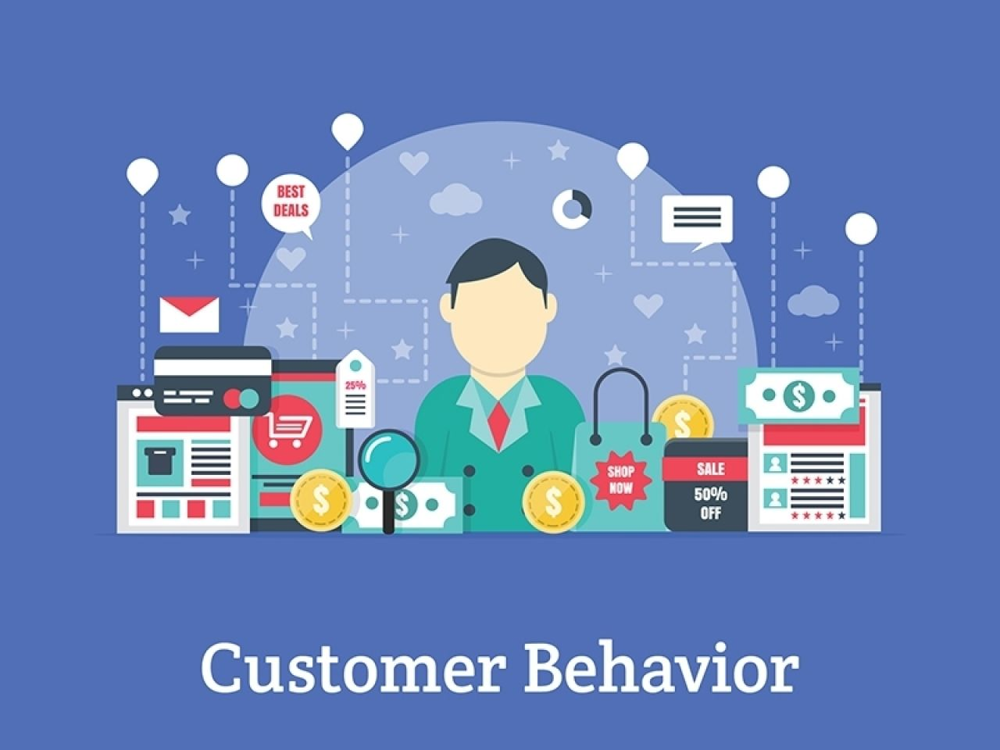
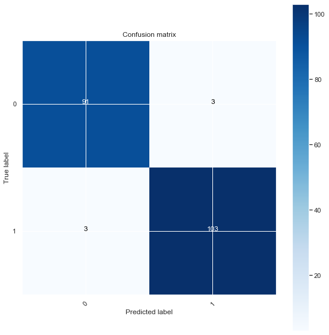
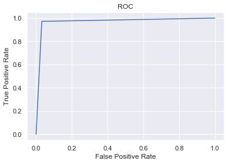
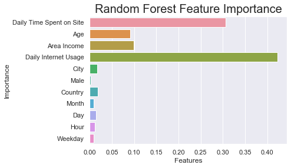

# 🎯 Consumer Behavior Modeling for Targeted Advertising Optimization

**Goal**: Predict which users are more likely to click on digital ads using behavioral and demographic data.

## 📌 Overview

This project analyzes consumer behavior data to predict ad click-through likelihood, integrating principles from behavioral economics and psychology. It aims to identify key factors influencing engagement and optimize marketing strategies accordingly.

We explore the effects of:
- Personal traits (age, income, internet usage)
- Contextual cues (ad topics, site usage patterns)
- Temporal patterns (time of day, weekday)

🔗 **Dataset**: [Kaggle Advertising Dataset](https://www.kaggle.com/fayomi/advertising)

## 📊 Exploratory Data Analysis (EDA)

### 🔢 Numerical Features
- Users spending ~50 minutes on-site are more likely to click ads than those spending ~80 minutes.
- Clickers typically have lower internet usage and area income, and are around 40 years old.

### 📝 Text Features
- Popular click-driving ad topics include: *team-oriented*, *context-sensitive*, *fully configurable*.

### 🕒 Temporal Patterns
- Click-through rates vary by hour and weekday.
- Older users (~40+) are more likely to click during off-peak hours.

### 🔄 Correlations
- Age and internet usage are strong predictors of click behavior.
- Both genders show higher engagement at lower income levels.

📌 **Visuals Included**:
- Correlation heatmaps
- Bigrams and word clouds
- Click-rate distribution plots

## ⚙️ Modeling

A **Random Forest Classifier** was trained with hyperparameter tuning via Grid Search.

**Metrics Achieved**:
- ✅ Accuracy: **97%**
- ✅ F1 Score: **0.97**

📈 **Key Features**:
- Daily Internet Usage
- Time Spent on Site
- Age
- Area Income

## 🧠 Behavioral Economics Insights

The model incorporates behavioral economics principles to explain how context, defaults, and pricing cues influence consumer decisions. Inspired by research from Dan Ariely and classic game theory examples, the analysis highlights how subtle framing can drive significant behavioral shifts.

📚 Reference:
- [Organ Donation Defaults Study](https://en.wikipedia.org/wiki/Organ_donation)
- [Consumer Behavior in Marketing](https://www.omniconvert.com/blog/consumer-behavior-in-marketing-patterns-types-segmentation.html)

## 📂 Project Structure

├── data/ # Dataset files
├── images/ # Visualizations for EDA and model performance
├── notebooks/ # Jupyter notebooks for analysis and modeling
├── src/ # Core Python scripts for data prep and training
└── README.md # Project documentation

## 🛠️ Tech Stack

- Python (Pandas, Scikit-learn, Matplotlib, Seaborn)
- Random Forest Classifier
- GridSearchCV for tuning
- WordCloud & NLTK for NLP
- Behavioral Economics + Game Theory Concepts

## 📌 Future Work

- Implement interpretable models like SHAP or LIME
- Extend to deep learning architectures (e.g., Wide & Deep)
- A/B testing integration for real-time performance

## 📫 Contact

Created by [@rahulsinghal1904](https://github.com/rahulsinghal1904) – feel free to reach out!

